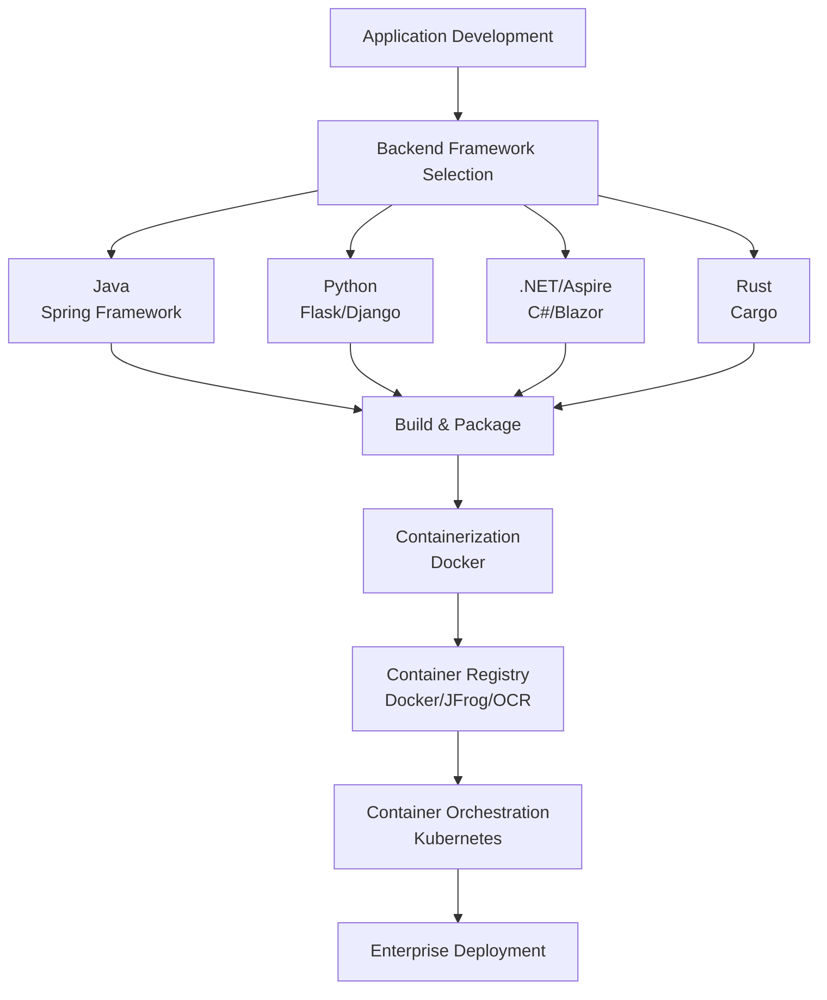
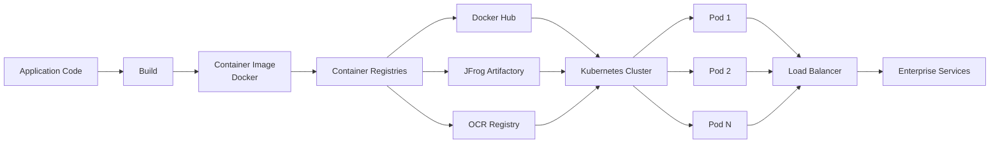
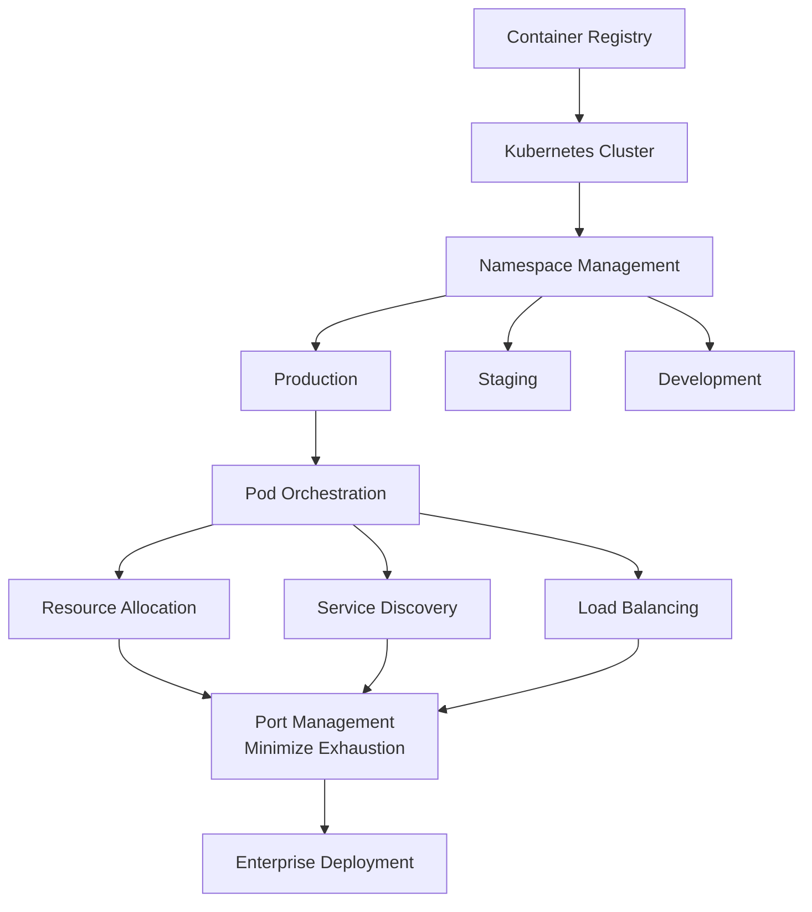
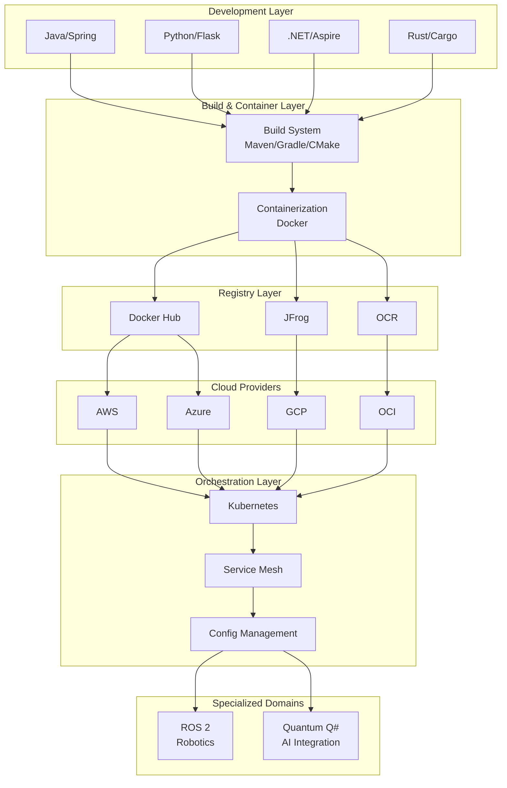

**Statement**: Mise en place
1. Read the recipe thoroughly;
2. Gather all tools & ingredients;
3. Prepare ingredients (wash, chop, measure);
4. Organize your workstation with everything in its logical spot;
5. Prepare equipment, like preheating ovens or setting out pans, before starting to cook to ensure efficiency and focus.
6. Don't get Lost in the Sauce

---

- Do Not limit yourself to one company. Learn from what they have. [NYSE](https://www.nyse.com/quote/XNYS:TGT) | [Seeking Alpha](https://seekingalpha.com/)
- Think Legos / Building Blocks / TETRIS!
- [My](https://dp.ucsf.edu/idp/) family

---

- [Setup](getting-started/src.md) Account, [ServiceNow](getting-started/servicenow.md), [BroadCom](https://support.broadcom.com) (VMware Account Creation / Support Portal)
- IF using [IT Catalog](https://support.servicenow.com/kb?id=kb_home), be prepared to [need a sponsor and answer](https://share.google/aimode/ai3Hxr0U0rcrdD1xb): How can you benefit company?
- [Power Platform](https://www.microsoft.com/en-us/power-platform) (*[Pages](https://www.microsoft.com/en-us/power-platform/products/power-pages) / [Teams](https://www.microsoft.com/en-us/microsoft-teams/log-in)*) / [MS DataVerse](https://www.microsoft.com/en-us/power-platform/dataverse) (Internal Research - [Dataverse](https://dataverse.org/), [Wiley](https://www.wiley.com/en-us/), [Elsevier](https://www.elsevier.com/), [Dryad](https://datadryad.org/about#our-partners)) 
- Viva ([Engage](https://www.microsoft.com/en-us/microsoft-viva/engage) / Yammer) / VS Code (Viva Connections) to deploy custom [SharePoint Framework solutions](https://www.youtube.com/watch?v=GXfnIZJZDzk) / [CPK](https://cloud.copilotkit.ai/sign-up) ([MAF](https://docs.copilotkit.ai/microsoft-agent-framework) / [Strands](https://docs.copilotkit.ai/aws-strands))
- .env is now in [Studio](https://www.microsoft.com/en-us/microsoft-365-copilot/microsoft-copilot-studio)>Topics>Variables also in Power Apps>[Solutions](https://learn.microsoft.com/en-us/power-apps/maker/data-platform/solutions-overview)>[AZ Key Vault](https://azure.microsoft.com/en-us/products/key-vault) or [Wizard](https://learn.microsoft.com/en-us/microsoft-copilot-studio/guidance/kit-setup-wizard)
- [Amazon Web Services](https://aws.amazon.com/) - AWS Portal / BrowserStack > App Automate > Appium
- VS Code is the SPFx Standard: While Visual Studio is optimized for .NET and C#, VS Code is designed specifically for high-performance front-end web development.
---


---

| Column One | Column Two | Column Three |
|:---------- | ---------- |:------------:|
| Row `1`    | Column `2` |              |
| *Row* 2    | **Row** 2  | Column ``3`` |


# Enterprise Architecture Pipeline Deployment Strategies

## Development Pipeline

Linear path for creating individual applications and programs with containerization for deployment

Multi-Platform Development & Container Orchestration Framework


### Linux
- [Enterprise Linux](https://www.oracle.com/linux/)
| [OCI Integration](https://www.oracle.com/cloud/)
| [AWS Setup](https://aws.amazon.com/)
| [Azure Setup](https://azure.microsoft.com/)
| [GCP Setup](https://cloud.google.com/)

### Database
- [PostgreSQL](https://www.postgresql.org/)
| [MySQL](https://www.mysql.com/)
| [MongoDB](https://www.mongodb.com/)
| [Redis](https://redis.io/)
| [Elasticsearch](https://www.elastic.co/elasticsearch)

### Java
- [Spring Initializr](https://start.spring.io/)
| [Spring Boot](https://spring.io/projects/spring-boot)
| [J2EE Architecture](https://www.oracle.com/java/technologies/)
| [Maven](https://maven.apache.org/) / [Gradle](https://gradle.org/)
| [Microservices](https://microservices.io/)

### .NET
- [Aspire Framework](https://learn.microsoft.com/en-us/dotnet/aspire/)
| [C# Language](https://learn.microsoft.com/en-us/dotnet/csharp/)
| [Blazor UI](https://dotnet.microsoft.com/en-us/apps/aspnet/web-apps/blazor)
| [Entity Framework](https://learn.microsoft.com/en-us/ef/)
| [ASP.NET Core](https://dotnet.microsoft.com/en-us/apps/aspnet)

### Python
- [Flask Framework](https://flask.palletsprojects.com/)
| [Django Web Framework](https://www.djangoproject.com/)
| [HTML Templates](https://www.w3schools.com/html/)
| [Data Processing](https://pandas.pydata.org/)
| [API Development](https://fastapi.tiangolo.com/)

### Rust
- [Cargo Package Manager](https://doc.rust-lang.org/cargo/)
| [TOML Configuration](https://toml.io/)
| [Memory Safety](https://www.rust-lang.org/)
| [High Performance](https://www.rust-lang.org/what/wasm/)
| [Concurrent Systems](https://doc.rust-lang.org/book/ch16-00-concurrency.html)

### CMake
- [Build System](https://cmake.org/)
| [Cross-Platform](https://cmake.org/documentation/)
| [C/C++ Support](https://cmake.org/cmake/help/latest/)
| [Multi-Configuration](https://cmake.org/cmake/help/latest/manual/cmake-generators.7.html)
| [Complex Projects](https://cmake.org/cmake/help/latest/command/find_package.html)

### ROS
- [ROS 2 Framework](https://docs.ros.org/en/humble/)
| [Robotics Systems](https://www.ros.org/)
| [DRAKE Simulation](https://drake.mit.edu/)
| [Middleware](https://design.ros2.org/articles/middleware_interface.html)
| [Distributed Computing](https://docs.ros.org/en/humble/Concepts/Intermediate/About-Ros2.html)

### Q# (Quantum)
- [Quantum Computing](https://azure.microsoft.com/en-us/products/quantum/)
| [Classical Hybrid](https://learn.microsoft.com/en-us/azure/quantum/)
| [AI Integration](https://learn.microsoft.com/en-us/azure/quantum/how-to-work-with-quantum-circuit-generator)
| [Job Submission](https://learn.microsoft.com/en-us/azure/quantum/how-to-submit-jobs)
| [QIR Code Preparation](https://learn.microsoft.com/en-us/azure/quantum/qir-introduction)

## Key Features

### 1. **Multi-Platform Support**
   - **Java/Spring**: Enterprise-grade microservices with Spring Framework
   - **Python/Flask**: Lightweight web applications and APIs
   - **.NET/Aspire**: Modern cloud-native C# applications
   - **Rust/Cargo**: High-performance, memory-safe systems
   - **CMake**: Cross-platform build system for C/C++
   - **ROS 2**: Robotics framework with DRAKE simulation
   - **Q#**: Quantum computing with AI integration

### 2. **Containerization & Registry**
   - Docker containerization of all application types
   - Support for multiple container registries:
     - Docker Hub
     - JFrog Artifactory
     - Oracle Container Registry (OCR)
   - Optimized container image building and distribution

### 3. **Kubernetes Orchestration**
   - Container and Pod management
   - Service discovery and load balancing
   - Port exhaustion minimization strategies
   - Multi-namespace deployments (Production, Staging, Development)
   - Resource allocation and scaling

### 4. **Multi-Cloud Integration**
   - AWS integration
   - Microsoft Azure setup
   - Google Cloud Platform (GCP)
   - Oracle Cloud Infrastructure (OCI)

### 5. **Specialized Domains**
   - **Robotics (ROS 2)**: Robot Operating System integration with DRAKE
   - **Quantum Computing (Q#)**: Classical-Hybrid quantum systems with AI job submission
   - **Enterprise Linux**: Foundation for all deployments

## Individual Backend Setup Architecture
```
Application Development
    ↓
Backend Framework Selection (Java, Python, .NET, Rust)
    ↓
Build & Package
    ↓
Containerization (Docker)
    ↓
Container Registry
    ↓
Container Orchestration (Kubernetes)
    ↓
Enterprise Deployment
```




## Container Workflow & Registry Architecture
```
Application Code → Build → Docker Image → Registry → Kubernetes → Pods → Load Balancer → Services
```



## Kubernetes Deployment Strategy



## Unified Enterprise Deployment Architecture




## Implementation Phases

### Phase 1: Foundation Setup
- Linux enterprise environment configuration
- Docker containerization infrastructure
- Single backend service deployment

### Phase 2: Multi-Platform Support
- Java/Spring integration and examples
- Python/Flask support and templates
- .NET/Aspire framework integration

### Phase 3: Orchestration
- Kubernetes cluster setup and configuration
- Container registry integration
- Service and pod management

### Phase 4: Advanced Features
- Multi-cloud integration
- ROS 2 robotics support
- Quantum computing Q# integration

### Phase 5: Enterprise Scale
- High availability configurations
- Disaster recovery mechanisms
- Performance optimization

### Phase 6: Future-Ready
- AI/ML integration capabilities
- Edge computing support
- Full quantum integration

## Technology Stack

### Languages
- Java, Python, C#, Rust, C++, Q#

### Frameworks & Tools
- Spring Boot, Flask, .NET Aspire, Cargo
- ROS 2, DRAKE, Docker, Kubernetes

### Cloud Platforms
- AWS, Azure, GCP, Oracle Cloud

### Container Technologies
- Docker, Kubernetes, Container Registries (Docker Hub, JFrog, OCR)

## Key Deployment Considerations

### Port Management
- Implement port allocation strategies to avoid exhaustion
- Use dynamic port assignment where possible
- Monitor port usage across Kubernetes nodes

### Container Optimization
- Minimize image sizes for faster deployment
- Use multi-stage builds for smaller images
- Implement health checks and readiness probes

### Cloud Integration
- Use infrastructure-as-code (Terraform, CloudFormation)
- Implement auto-scaling policies
- Configure proper networking and security groups

### Service Mesh
- Implement traffic management
- Enable service-to-service communication
- Configure circuit breakers and retry logic

## Development Workflow

1. **Design**: Use architecture diagrams for planning
2. **Develop**: Choose appropriate framework per use case
3. **Build**: Use platform-specific build tools
4. **Containerize**: Create Docker images
5. **Test**: Validate in development Kubernetes namespace
6. **Deploy**: Push to staging, then production
7. **Monitor**: Track metrics and logs
8. **Scale**: Adjust resources based on demand

## Best Practices

### Code Organization
- Separate concerns by platform/technology
- Use mono-repo or multi-repo strategy consistently
- Maintain clear dependency declarations

### Container Security
- Scan images for vulnerabilities
- Use minimal base images
- Implement network policies
- Apply resource limits

### Kubernetes Best Practices
- Use namespaces for environment separation
- Implement RBAC for access control
- Set up network policies
- Monitor resource usage

### Cloud Integration
- Use managed services where appropriate
- Implement auto-scaling
- Set up proper backup and recovery
- Monitor cross-region deployments

## Performance Optimization

1. **Caching Strategies**: Implement Redis/Memcached
2. **Database Optimization**: Use connection pooling, indexing
3. **Load Distribution**: Implement load balancers, CDN
4. **Monitoring**: Use Prometheus, ELK stack
5. **Tracing**: Implement distributed tracing (Jaeger)

## Security Considerations

1. **Network Security**: Implement firewalls, VPCs, security groups
2. **Authentication**: Use OAuth 2.0, JWT, mTLS
3. **Encryption**: TLS for transport, encryption at rest
4. **Secrets Management**: Use HashiCorp Vault, AWS Secrets Manager
5. **Compliance**: Ensure GDPR, HIPAA, SOC 2 compliance as needed

## Monitoring & Logging

1. **Metrics**: Prometheus for metrics collection
2. **Logging**: ELK Stack or CloudWatch
3. **Tracing**: Jaeger for distributed tracing
4. **Alerting**: PagerDuty, Slack integration
5. **Dashboards**: Grafana for visualization

## Maintenance & Updates

1. Regular security patches
2. Framework version upgrades
3. Kubernetes cluster updates
4. Container image rebuilds
5. Dependency updates and audits

## References

- [Docker Documentation](https://docs.docker.com/)
- [Kubernetes Documentation](https://kubernetes.io/docs/)
- [Spring Boot Documentation](https://spring.io/projects/spring-boot)
- [Flask Documentation](https://flask.palletsprojects.com/)
- [.NET Aspire Documentation](https://learn.microsoft.com/en-us/dotnet/aspire/)
- [Rust Book](https://doc.rust-lang.org/book/)
- [ROS 2 Documentation](https://docs.ros.org/en/humble/)
- [Azure Quantum Documentation](https://learn.microsoft.com/en-us/azure/quantum/)
